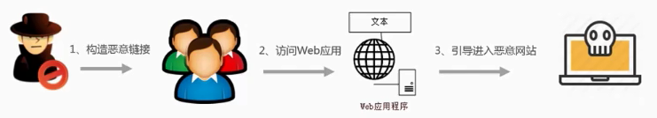

# 常见Web攻击 --egg
https://eggjs.org/zh-cn/core/security.html#web-%E5%AE%89%E5%85%A8%E6%A6%82%E5%BF%B5
# 常见Web攻击 --me
1. https://www.cnblogs.com/fundebug/p/details-about-6-web-security.html
2. https://www.npmjs.com/
## 1. XXS（跨站脚本攻击）
XSS攻击：跨脚本攻击。指的是攻击者在网页中嵌套，恶意脚本程序，当用户打开网页时，程序开始在浏览器上启动，盗取用户的cooks，从而盗取密码等信息，下载执行木马程序

攻击方式如图所示。


例如:在评论区输入

```javascript
<script>alert(1)</script>
```

解决方法：XSS之所以会发生,是因为用户输入的数据变成了代码。因此,我们需要对用户输入的数据进行HTML转义处理,将其中的“尖括号”、“单引号”、“引号” 之类的特殊字符进行转义编码。

**Node模块：xss**

```shell
const xss = require('xss');
let html = xss('<script>alert("xss");</script>');
console.log(html);
```
## 2. CSRF(跨站请求伪造)
CSRF攻击：跨站伪造。 是一种挟制用户在当前已登录的Web应用程序上执行非本意的操作的攻击方法。

攻击方式如图所示。例如：展示可爱猫咪的同时，向银行发起请求要求转账。


解决方法：
1. 验证 HTTP Referer 字段
2. 在请求地址中添加 token 并验证
3. 在 HTTP 头中自定义属性并验证

Node模块：csrf
1. Express/connect: csurf or alt-xsrf
2. Koa: koa-csrf or koa-atomic-session
3. Add middleware in Koa app (default options are shown):
```javascript
const Koa = require('koa');
const bodyParser = require('koa-bodyparser');
const session = require('koa-generic-session');
const convert = require('koa-convert');
const CSRF = require('koa-csrf');
 
const app = new Koa();
 
// set the session keys
app.keys = [ 'a', 'b' ];
 
// add session support
app.use(convert(session()));
 
// add body parsing
app.use(bodyParser());
 
// add the CSRF middleware
app.use(new CSRF({
  invalidTokenMessage: 'Invalid CSRF token',
  invalidTokenStatusCode: 403,
  excludedMethods: [ 'GET', 'HEAD', 'OPTIONS' ],
  disableQuery: false
}));
 
// your middleware here (e.g. parse a form submit)
app.use((ctx, next) => {
  if (![ 'GET', 'POST' ].includes(ctx.method))
    return next();
  if (ctx.method === 'GET') {
    ctx.body = ctx.csrf;
    return;
  }
  ctx.body = 'OK';
});
 
app.listen();
```
Jade Template:
```javascript
form(action='/register', method='POST')
  input(type='hidden', name='_csrf', value=csrf)
  input(type='email', name='email', placeholder='Email')
  input(type='password', name='password', placeholder='Password')
  button(type='submit') Register
```
EJS Template:
```javascript
<form action="/register" method="POST">
  <input type="hidden" name="_csrf" value="<%= csrf %>" />
  <input type="email" name="email" placeholder="Email" />
  <input type="password" name="password" placeholder="Password" />
  <button type="submit">Register</button>
</form>
```
## 3. 点击劫持
点击劫持：点击劫持是一种视觉欺骗的攻击手段。攻击者将需要攻击的网站通过 iframe 嵌套的方式嵌入自己的网页中，并将 iframe 设置为透明，在页面中透出一个按钮诱导用户点击。

例如：用户在登陆 A 网站的系统后，被攻击者诱惑打开第三方网站，而第三方网站通过 iframe 引入了 A 网站的页面内容，用户在第三方网站中点击某个按钮（被装饰的按钮），实际上是点击了 A 网站的按钮。

解决方法：X-FRAME-OPTIONS是一个 HTTP 响应头，在现代浏览器有一个很好的支持。这个 HTTP 响应头 就是为了防御用 iframe 嵌套的点击劫持攻击。

## 4. URL跳转漏洞
URL跳转：借助未验证的URL跳转，将应用程序引导到不安全的第三方区域，从而导致的安全问题。

URL跳转漏洞如下所示。


例如：
```PHP
访问网址为：http://www.wooyun.org/login.php?jumpto=http://www.evil.com

<?php 
$url=$_GET['jumpto'];
header("Location: $url");
?>
```
解决方法：
1. referer的限制
2. 加入有效性验证Token
## 5. SQL注入攻击
SQL注入攻击：SQL注入是比较常见的网络攻击方式之一，它不是利用操作系统的BUG来实现攻击，而是针对程序员编程时的疏忽，通过SQL语句，实现无帐号登录，甚至篡改数据库。

SQL注入攻击如下所示。


例如：
```javascript
预想Web输入：admin=admin,password=123456 
预想SQL查询：SELECT * FROM user WHERE username='admin' AND psw='password'
实际Web输入：admin=admin'--,password='xxxx'
实际SQL查询：SELECT * FROM user WHERE username='admin' --' AND psw='xxxx'
其中'--是SQL注释实际为：SELECT * FROM user WHERE username='admin'
```

解决方法：
1. 严格限制Web应用的数据库的操作权限，给此用户提供仅仅能够满足其工作的最低权限，从而最大限度的减少注入攻击对数据库的危害
2. 后端代码检查输入的数据是否符合预期，严格限制变量的类型，例如使用正则表达式进行一些匹配处理。
3. 对进入数据库的特殊字符（'，"，，<，>，&，*，; 等）进行转义处理，或编码转换。基本上所有的后端语言都有对字符串进行转义处理的方法，比如 lodash 的 lodash._escapehtmlchar 库。
4. 所有的查询语句建议使用数据库提供的参数化查询接口，参数化的语句使用参数而不是将用户输入变量嵌入到 SQL 语句中，即不要直接拼接 SQL 语句。例如 Node.js 中的 mysqljs 库的 query 方法中的 ? 占位参数.

Node模块：node-mysql
1. 使用escape()对传入参数进行编码。
```javascript
var userId = 1, name = 'test';
var query = connection.query('SELECT * FROM users WHERE id = ' + connection.escape(userId) + ', name = ' + connection.escape(name), function(err, results) {
  // ...
});
console.log(query.sql); // SELECT * FROM users WHERE id = 1, name = 'test'
```
2. 使用connection.query()的查询参数占位符。
```javascript
var userId = 1, name = 'test';
var query = connection.query('SELECT * FROM users WHERE id = ?, name = ?', [userId, name], function(err, results) {
  // ...
});
console.log(query.sql); // SELECT * FROM users WHERE id = 1, name = 'test'
```
3. 使用escapeId()编码SQL查询标识符。
```javascript
var sorter = 'date';
var sql  = 'SELECT * FROM posts ORDER BY ' + connection.escapeId(sorter);
connection.query(sql, function(err, results) {
 // ...
});
```
4. 使用mysql.format()转义参数。
```javascript
var userId = 1;
var sql = "SELECT * FROM ?? WHERE ?? = ?";
var inserts = ['users', 'id', userId];
sql = mysql.format(sql, inserts); // SELECT * FROM users WHERE id = 1
```
## 6. OS命令注入攻击
OS命令注入攻击：
OS命令注入和SQL注入差不多，只不过SQL注入是针对数据库的，而OS命令注入是针对操作系统的。
OS命令注入攻击指通过Web应用，执行非法的操作系统命令达到攻击的目的。
只要在能调用Shell函数的地方就有存在被攻击的风险。
倘若调用Shell时存在疏漏，就可以执行插入的非法命令。

SQL注入攻击如下所示。


例如：
```javascript
const exec = require('mz/child_process').exec;
let params = {/* 用户输入的参数 */};
exec(`git clone ${params.repo} /some/path`);
```
1. 如果 params.repo 传入的是 https://github.com/admin/admin.github.io.git
   确实能从指定的 git repo 上下载到想要的代码。
2. 但是如果 params.repo 传入的是 https://github.com/xx/xx.git && rm -rf /* &&
   恰好你的服务是用 root 权限起的就糟糕了。

# Node解决方案

## 1. Helmet

```SHELL
Helmet helps you secure your Express apps by setting various HTTP headers. It's not a silver bullet, but it can help!
```

URL:`https://www.npmjs.com/package/helmet`

Usage:

```javascript
const express = require("express");
const helmet = require("helmet");

const app = express();

// This...
app.use(helmet());

// ...is equivalent to this:
app.use(helmet.contentSecurityPolicy());
app.use(helmet.dnsPrefetchControl());
app.use(helmet.expectCt());
app.use(helmet.frameguard());
app.use(helmet.hidePoweredBy());
app.use(helmet.hsts());
app.use(helmet.ieNoOpen());
app.use(helmet.noSniff());
app.use(helmet.permittedCrossDomainPolicies());
app.use(helmet.referrerPolicy());
app.use(helmet.xssFilter());
```

| 方法名称                     |          描述          | 防止攻击类型                                                 | 默认策略                                                     |
| :--------------------------- | :--------------------: | :----------------------------------------------------------- | :----------------------------------------------------------- |
| contentSecurityPolicy        |    内容安全策略设置    | 防止跨站脚本攻击（XXS）和数据包嗅探                          | 通过设置 Content-Security-Policy 这个 header 来防止被恶意注入 js, css, plugins 或者更多的内容。**默认不启用。** |
| dnsPrefetchControl           |     DNS预解析设置      | 防止`dns-prefetch`，导致的用户隐私泄露、dns服务过载、页面统计失真等问题。 | 通过将`X-DNS-Prefetch-Control`设置为`off`禁止浏览器进行DNS预解析。 |
| expectCt                     |     证书透明度设置     | 防止证书劫持                                                 | **默认不启用。**                                             |
| frameguard                   |       iframe设置       | 防止点击劫持                                                 | 通过设置`x-frame-options`，不允许使用`iframe`的域。          |
| hidePoweredBy                |    隐藏背后服务技术    | 攻击者可以针对`X-Powered-By`中暴露的服务器语言的漏洞进行攻击。 | 隐藏或混淆响应头中的`X-Powered-By`字段以迷惑攻击者。         |
| hsts                         |      严格模式设置      | 防止降级攻击和`cookie`劫持                                   | 设置`Strict-Transport-Security`告知用户在一定的时间段使用`https`访问。默认启用。 |
| ieNoOpen                     |        下载设置        | 有些站点可能提供了HTML文件的下载，部分IE浏览器中，该文件会在站点的上下文打开，存在脚本注入的风险。 | 设置`X-Download-Options`为`noopen`不允许在在站点的上下文打开下载的HTML文件。默认启用。 |
| noSniff                      | 禁止浏览器嗅探文件类型 | 防止使用虚假文件类型欺诈                                     | 设置 `X-Content-Type-Options`为`nosniff`后，浏览器不再进行自动识别。这意味着响应的文件类型如果与`Content-Type`中声明的不一致，将会被浏览器屏蔽掉。默认启用。 |
| permittedCrossDomainPolicies |        跨域策略        |                                                              | 默认不允许跨域。                                             |
| referrerPolicy               |    隐藏Referer标题     |                                                              | 默认启用。                                                   |
| xssFilter                    |    防止部分XSS攻击     |                                                              | 默认启用。                                                   |

1. `xssFiter` 防跨域脚本攻击（XXS）
2. `permittedCrossDomainPolicies` 防跨站请求伪造（CSRF）|| `koa-csrf`颁发token 
3. `frameguard` 防点击劫持
4. `检查url是否符合规则或设置白名单` 防URL跳转漏洞
5. `node-mysql合规访问数据库` 防SQL注入
6. `设置白名单` 防OS命令注入

